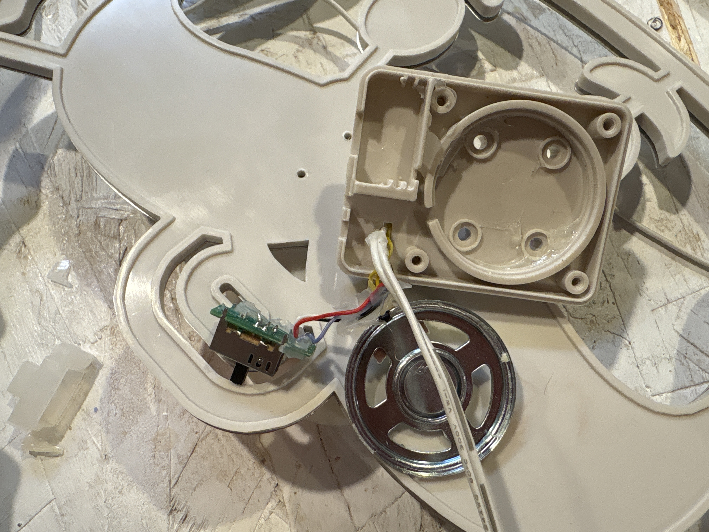
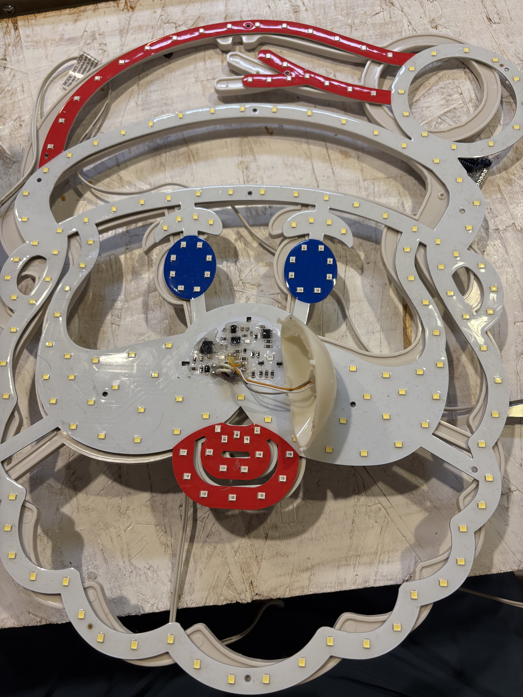
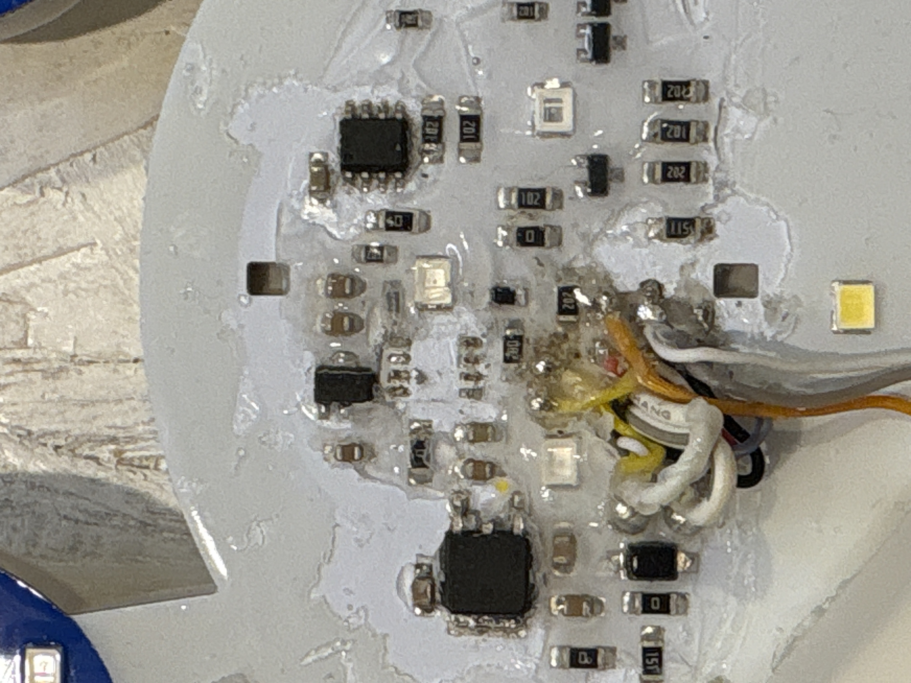
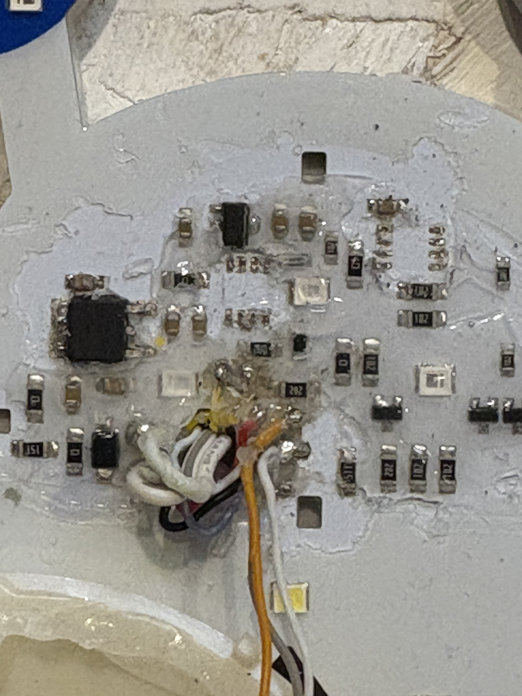
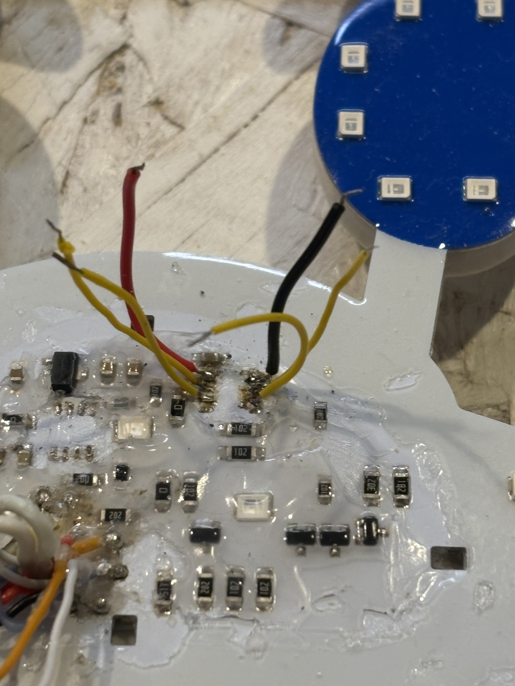
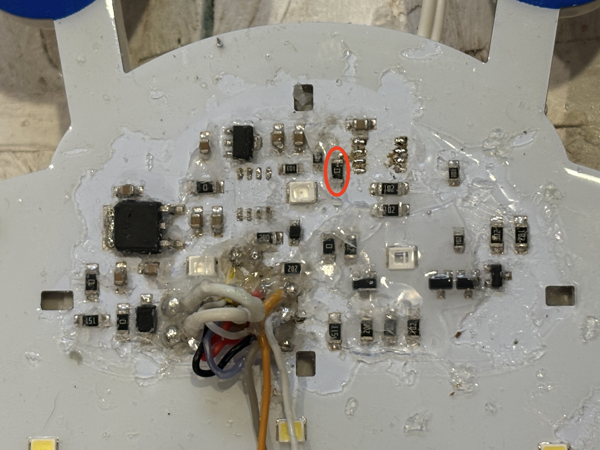
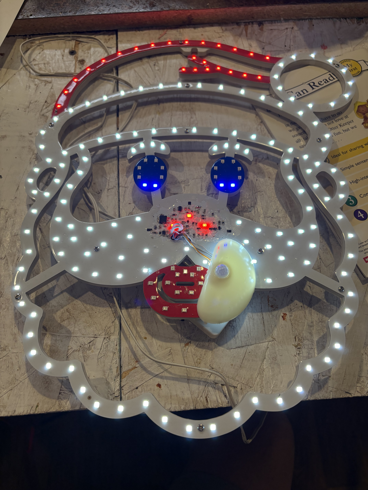

This is a diary of my attempts to hack an LED Singing Santa from Menards: https://www.menards.com/main/p-1642874280394068.htm

I took off the back, that was just a speaker & switch. 

Then I took off the nose.  Underneath there are all the components.  All surface mounted. 

Found 2 8 pin ICs that look intriguing.  Removed the center one hoping that was the controller.  Nope, still worked fine (aside from the audio.  I had already destroyed the speaker). 

Second IC was removed, now its only lighting up the static elements. 

Pin 1 is 3.3v, Pin 8 is GND.  Pin 2, 3, 6, 7 all control the rest of the elements.  I just need to try to put an ESP in here to drive those. 

I got my ESP32 with WLED flashed wired in.  It is flakey, I suspect it doesn't have enough juice on the 3.3v line to run the esp.  I probably need to power it separately from the 22v line with another regulator?

And now I touched the 3.3v line to the wrong thing and BOOM.  It's fired.  What I think is the 3.3v regular is now not really doing anything.  I'm going to replace that & see what happens.

I did some poking around... Actually Gus was poking around with the ohm meter... And verified the pwr & gnd pins on the IC I'm trying to replace were shorted out.  I then tried to remove a cap near it, no change, then I removed a jumper near it and it worked! (A note here, I removed the wires to the IC pads just to reduce complexity / risk of shorts) 

Looks like we're back on track! 
