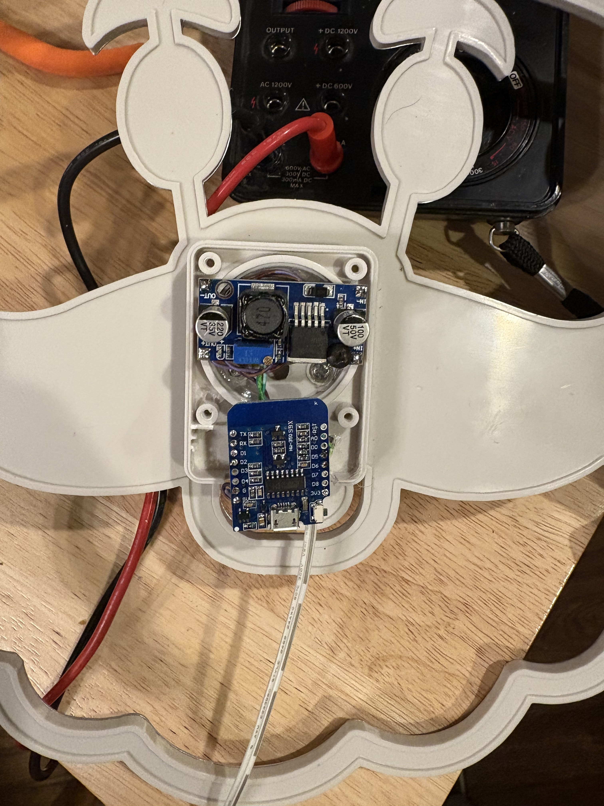
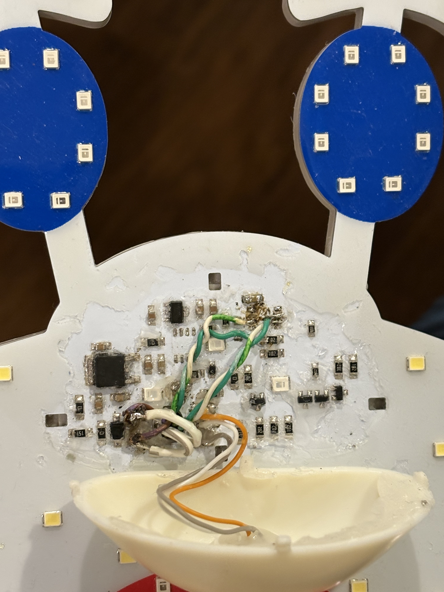
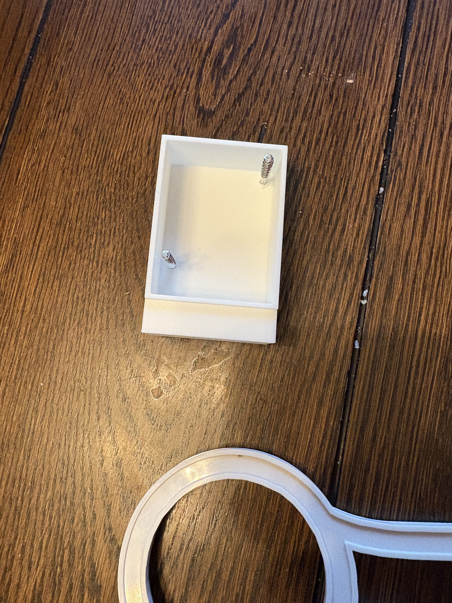

This is a diary of my attempts to hack an LED Singing Santa from Menards: https://www.menards.com/main/p-1642874280394068.htm

I took off the back, that was just a speaker & switch. 

Then I took off the nose.  Underneath there are all the components.  All surface mounted. 

Found 2 8 pin ICs that look intriguing.  Removed the center one hoping that was the controller.  Nope, still worked fine (aside from the audio.  I had already destroyed the speaker). 

Second IC was removed, now its only lighting up the static elements. 

Pin 1 is 3.3v, Pin 8 is GND.  Pin 2, 3, 6, 7 all control the rest of the elements.  I just need to try to put an ESP in here to drive those. 

I got my ESP32 with WLED flashed wired in.  It is flakey, I suspect it doesn't have enough juice on the 3.3v line to run the esp.  I probably need to power it separately from the 22v line with another regulator?

And now I touched the 3.3v line to the wrong thing and BOOM.  It's fired.  What I think is the 3.3v regular is now not really doing anything.  I'm going to replace that & see what happens.

I did some poking around... Actually Gus was poking around with the ohm meter... And verified the pwr & gnd pins on the IC I'm trying to replace were shorted out.  I then tried to remove a cap near it, no change, then I removed a jumper near it and it worked! (A note here, I removed the wires to the IC pads just to reduce complexity / risk of shorts) 

Looks like we're back on track! 

To fix the flakey ESP32, I added an adjustable voltage regular.  I soldered to the 29v lines and ran the lines through the hole to the back, then put the regular there, with an output of 5v.  Then also wired to the ESP32 on the back.  I had to drill another hole in the old speaker case to get the wires to line up easily. 

Now the ESP works, however we are missing one line of the santa mouth.  This is due to me accidentially ripping off a solder pad from the old IC.  To fix it, I made use of the fact that the LEDs are really sensitive.  If I just tap the right part of the circuit with my finger I can find out where the pad led to.  Doing so I found the right resister, and soldered the missing wire to that, and had all the wires go through to the back. 

I soldered to the GPIO 4, 5, 12, 14 pins.  Initially I went with GPIO 1, but that was... problematic for some reason.  I suspect some power on conditions.

Now its all great except we need a back.  I asked Ardan to model & print me a back! 

Final thing I realized is WLED does *not* let me expose on/off gpio pins to xlights!  I instead installed espixelstick, and that lets me have relay outputs that are exposed to xlights.
